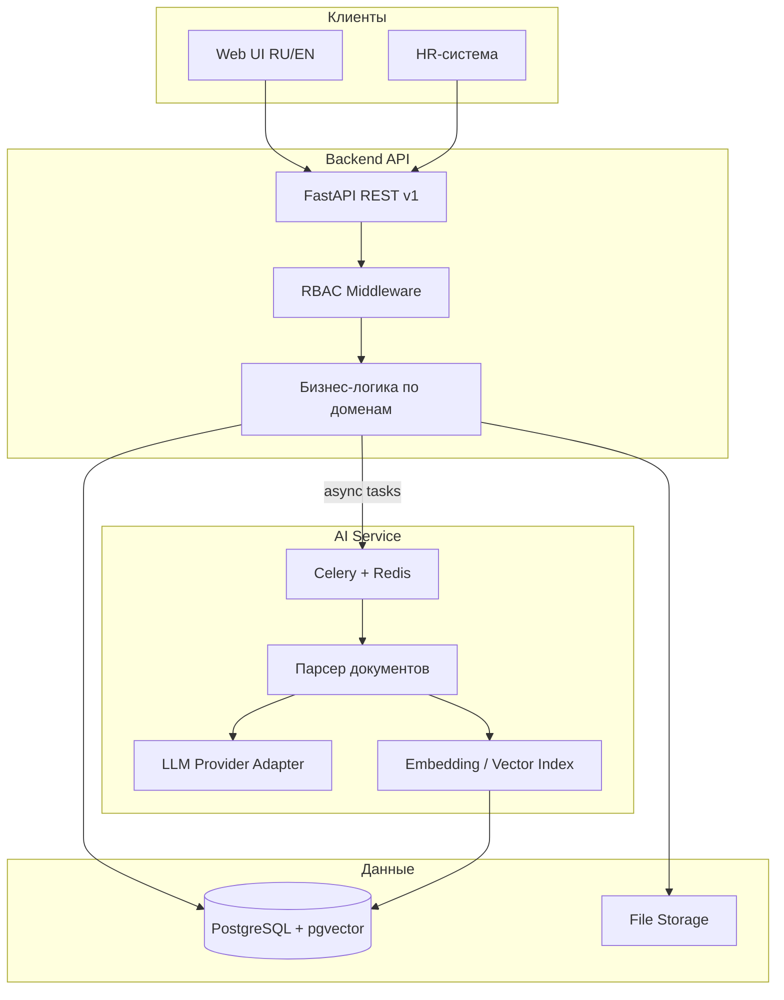

# Архитектура Dream To

## Обзор

Система построена по принципу **модульного монолита** (backend) + **выделенного микросервиса** (AI) + **SPA-фронтенда**.



## Доменные модули Backend

| Модуль | Пакет | Ответственность |
|--------|-------|-----------------|
| Оборудование | `equipment` | CRUD, настраиваемые поля, связи |
| Документы | `documents` | Загрузка PDF/DOCX, версии, статусы |
| Тех. карты | `tech_cards` | Регламенты ТО по периодичности |
| Календарь ТО | `maintenance_calendar` | Агрегация графика на дату |
| Инструкции | `instructions` | Шаги/моменты/причины, workflow утверждения |
| TWI-курсы | `twi_courses` | Генерация, назначение, прогресс |
| Компетенции | `competencies` | Матрица, навыки, уровни |
| Пользователи | `users` | Auth, роли, специализации |
| HR | `hr` | Синхронизация сотрудников |
| AI Processing | `ai_processing` | Прокси к AI-сервису, статусы задач |
| Knowledge | `knowledge` | Q&A поиск по векторной БЗ |
| Brandbook | `brandbook` | Корпоративные шаблоны |

## Версионирование контента

Все контентные сущности (документы, инструкции, курсы) поддерживают:

```
draft → pending_approval → published → archived
```

- Каждая версия хранится в `*_versions` с полной историей изменений
- Текущая «активная» версия ссылается через `current_version_id`
- Связь версий: `parent_version_id` для цепочки ревизий

## Настраиваемые поля

Таблица `custom_field_definitions` описывает динамические поля для сущностей.
Значения хранятся в JSONB-колонке `custom_attributes` без изменения DDL.

## AI-пайплайн

1. Загрузка документа → привязка к `equipment_id`
2. Задача в очередь: извлечение текста (PDF/DOCX/TXT)
3. Chunking + embedding → `knowledge_chunks` (pgvector)
4. LLM-анализ → структурированные работы → `tech_cards`
5. LLM → инструкции (шаги/моменты/причины) → `work_instructions`
6. Утверждение → генерация TWI-курса
7. Агрегация компетенций для матрицы

## Масштабирование

- Backend и AI-service — stateless, горизонтальное масштабирование за load balancer
- Celery workers — масштабируются независимо
- PostgreSQL — primary/replica при росте нагрузки
- Файлы — S3-совместимое хранилище (конфигурируемо)
