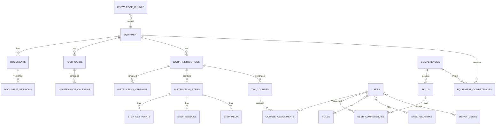

# Модель данных

## ER-диаграмма (основные сущности)

## Ключевые таблицы

### equipment
| Колонка | Тип | Описание |
|---------|-----|----------|
| id | UUID PK | Идентификатор |
| name | VARCHAR | Название аттракциона |
| serial_name | VARCHAR | Серийное название |
| custom_attributes | JSONB | Настраиваемые поля |
| is_active | BOOLEAN | Активен |
| created_at / updated_at | TIMESTAMPTZ | Аудит |

### documents
| Колонка | Тип | Описание |
|---------|-----|----------|
| id | UUID PK | |
| equipment_id | UUID FK | Привязка к оборудованию |
| title | VARCHAR | Название |
| file_path | VARCHAR | Путь к файлу |
| mime_type | VARCHAR | PDF, DOCX и т.д. |
| status | ENUM | draft / pending_approval / published / archived |
| current_version_id | UUID FK | Текущая версия |
| ai_processing_status | ENUM | pending / processing / completed / failed |
| custom_attributes | JSONB | |

### tech_cards
| Колонка | Тип | Описание |
|---------|-----|----------|
| id | UUID PK | |
| equipment_id | UUID FK | |
| maintenance_type | ENUM | annual / semi_annual / quarterly / monthly / weekly / daily |
| title | VARCHAR | Название работы |
| work_items | JSONB | Перечень операций (корп. формат) |
| status | ENUM | Статус версионирования |

### work_instructions
| Колонка | Тип | Описание |
|---------|-----|----------|
| id | UUID PK | |
| equipment_id | UUID FK | |
| tech_card_id | UUID FK nullable | Связь с тех. картой |
| title | VARCHAR | |
| status | ENUM | draft / pending_approval / published / archived |
| current_version_id | UUID FK | |

### instruction_steps
| Колонка | Тип | Описание |
|---------|-----|----------|
| id | UUID PK | |
| instruction_version_id | UUID FK | |
| step_number | INT | Порядок |
| title | TEXT | Заголовок шага |
| description | TEXT | Описание |
| safety_notes | TEXT | Меры безопасности |
| tools | JSONB | Инструменты |
| consumables | JSONB | Расходники |
| control_params | JSONB | Контрольные параметры |

### competencies / skills / user_competencies
- `competencies` — группы компетенций (привязка к оборудованию)
- `skills` — навыки внутри компетенции
- `competency_levels` — шкала уровней (1–5 или настраиваемая)
- `user_competencies` — оценка сотрудника по навыку

### knowledge_chunks (векторный поиск)
| Колонка | Тип | Описание |
|---------|-----|----------|
| id | UUID PK | |
| equipment_id | UUID FK nullable | Контекст |
| source_type | ENUM | document / instruction / tech_card |
| source_id | UUID | ID источника |
| content | TEXT | Текст фрагмента |
| embedding | VECTOR(1536) | Вектор для поиска |
| metadata | JSONB | Доп. контекст |

### custom_field_definitions
| Колонка | Тип | Описание |
|---------|-----|----------|
| entity_type | VARCHAR | equipment, document, ... |
| field_key | VARCHAR | Ключ поля |
| field_label | JSONB | {ru, en} |
| field_type | ENUM | text / number / date / select / boolean |
| options | JSONB | Для select |
| is_required | BOOLEAN | |

## Перечисления (ENUM)

- `content_status`: draft, pending_approval, published, archived
- `maintenance_type`: annual, semi_annual, quarterly, monthly, weekly, daily
- `ai_task_status`: pending, processing, completed, failed
- `course_progress_status`: assigned, in_progress, completed, failed
- `user_role`: admin, park_owner, mentor, technician, hr

## Индексы

- GIN на `custom_attributes` для фильтрации
- HNSW/IVFFlat на `knowledge_chunks.embedding` для векторного поиска
- Составные индексы: `(equipment_id, status)`, `(equipment_id, maintenance_type)`
